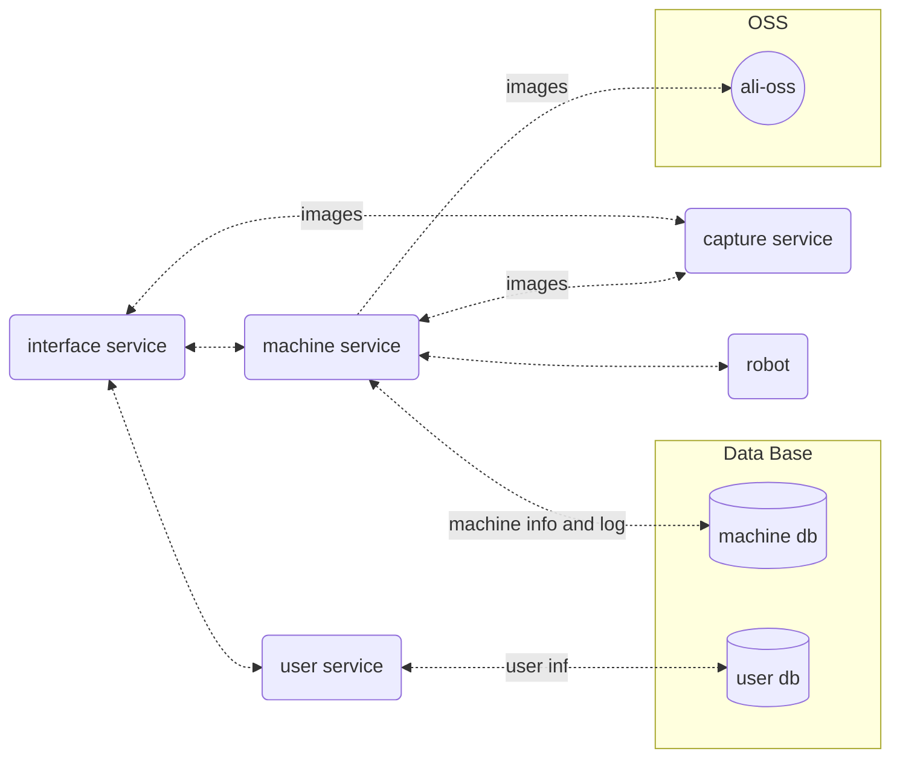

<!-- PROJECT SHIELDS -->

<!-- PROJECT LOGO -->
 

<!--    -->

<h3 align="center">htp-platform</h3>

  

    高附加值作物的智能表型测定系统——基于新型绳驱并联机器人
     
    <a href="https://hominsu.github.io/htp-platform/"><strong>Explore the docs »</strong></a>
     
     
    <a href="https://github.com/ynu-e-young/htp-platform">View Demo</a>
    ·
    <a href="https://github.com/ynu-e-young/htp-platform/issues">Report Bug</a>
    ·
    <a href="https://github.com/ynu-e-young/htp-platform/issues">Request Feature</a>
  

## Description

高附加值作物的智能表型测定系统——基于新型绳驱并联机器人

## Details

